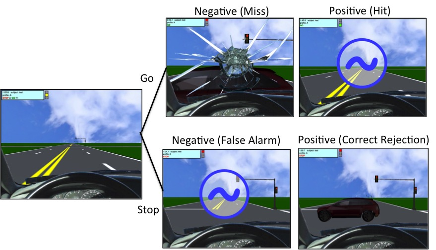
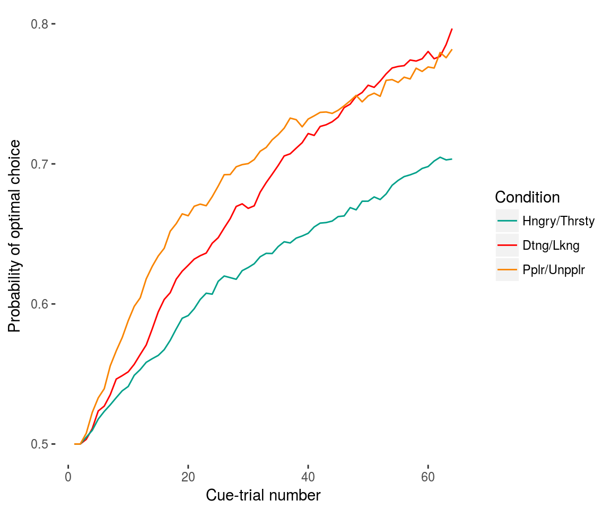
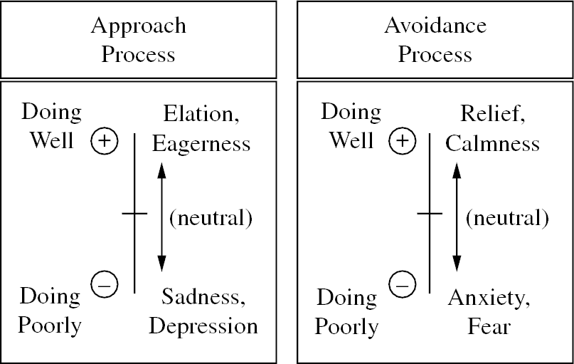
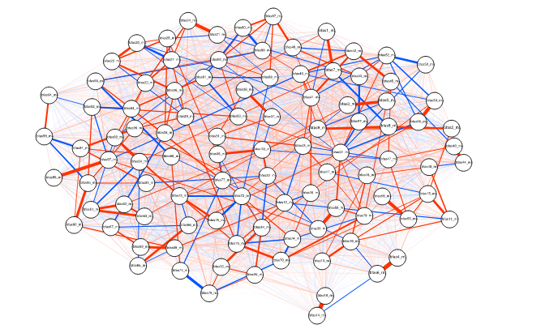
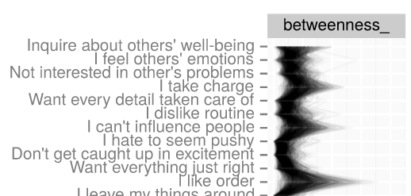

```{r setup, include=FALSE}
knitr::opts_chunk$set(echo = FALSE, warning = FALSE, error = FALSE, message = FALSE)
inv_logit <- function(x){
    exp(x)/(1+exp(x))
}
```


## Problems I focus on {.build}

Why do we observe increases in negative health risk during Adolescence?

Can we gain insight into the causes of adolescent risk-tolerance by If we understand individual differences in thought and behavior as _strategies_ for satisfying fundamental motivations?

## Methodological approaches

- Modeling development (adolescence, adulthood)
    - Models encode hypotheses
        - Networks versus latent variables ([Network model of personality](https://figshare.com/articles/A_Network_Approach_to_Characterizing_Personality_in_the_Life_and_Time_Longitudinal_Sample/1447279/2))
        - Distinguishing sources of variance ([RI-CLPM](https://jflournoy.github.io/2017/10/20/riclpm-lavaan-demo/), LCM-SR)
- Modeling behavior
    - Increase reliability of individual differences in behavior (Yellow Light Game)
    - Allow measurement of latent process (Social Probabilistic Learning Task)

# Adolescent risk taking {.build}

The big question: Why do negative health outcomes increase in adolescence?

## Negative health outcomes and health risking behavior


- Increases in unintentional injury
- ... alcohol and drug abuse (Hooshmand, Willoughby, & Good, 2012)
- ... risky sexual behavior (Stevenson, Zimmerman, & Caldwell, 2007)

## Changes in risk and reward processing

Explanations focus on 

- Reward sensitivity during risky choices (e.g., Casey, 2015)
- ... in peer contexts (e.g., Peake et al., 2013, Silva et al., 2016).

# The Yellow Light Game {.build}

Characterizing a laboratory paradigm commonly used to investigate risk decisions.

## The Stoplight Game

The Stoplight Game (Steinberg et al, 2008) has been used in dozens of experiments as a measure of risk-taking 

- Small correlations with self report sensation seeking (r=.2; Harden et al., 2017; Steinberg et al. 2008)
- Game-elicited neural response correlates with convergent measures (Kahn et al., 2014)
- However, some aspects of this task remain unclear
    - Making a risky choice also increases task performance (stop = -3s, EV of go = -1.8s)
    - Most variance is not shared with convergent measures (Harden et al, 2017)

## The psychometric properties of Stoplight

[Harden et al. 2017](https://doi.org/10.1016/j.dcn.2016.12.007): 398 twins, 4 factors capture variance of a wide range of cognitive control and incentive processing tasks 

- Reward-seeking factor loadings (A = .66, E = .34)

        Stoplight: intersections  0.32
        IGT: Good decks           0.56
        IGT: Bad decks            0.22
        Delay Discounting         0.15
        BART: Avg. adjusted pumps 0.47	
        Sensation seeking         0.16
- Stoplight *unique* variance: 78% is non-shared env + measurement error
- A lot of unaccounted for variance

## Aims of the Yellow Light Game study

1. Increase precision of task design
2. Through modeling, Improve relaibility

## Aim 1: Task design improvements

[The Yellow Light Game](https://dsn.uoregon.edu/research/yellow-light-game/) software is Customizable. 

In the configuration for this study:

- We can distinguish propensity to choose risk option, and learning
- Performance insensitive to overall proportion of risk choice
- But one can learn to increase performance

## YLG Task Protocol description



- Each intersection has 1 of 3 risk levels 
- Risk levels correspond to different yellow light onsets
    - 12 "middle" P(crash) = .5
    - 4 "late" P(crash) = .25
    - 4 "early" P(crash) = .75
- Driving simulation, 8 runs, 20 intersections per run
- Run 5 and 6 (**peer**): watched by two "peers" via remote desktop after cyberball inclusion
- Run 7 and 8 (**excl**): watched after being excluded in cyberball

## Aim 2: Modeling improvements

a. Can we improve between-person proportion of variance?
b. Can we distinguish risk-tolerance from learning?
    - ... and are there differences in peer effects across parameters?
c. How do these modeling choices affect convergent correlations?

## The data to model

N = 174, all analyses available in R package: [`ylglearning`](https://jflournoy.github.io/ylglearning/)


## 2a. Improve between-person variance

Logistic regression captures the common measure of simple proportion of non-stop intersections.

ICC<sub>pGo</sub> = [0.12](https://jflournoy.github.io/ylglearning/articles/ylg_descriptives_and_diagnostics.html#task-reliability)

This could be one explanation for the somewhat small correlations in the literature.

## 2a. Diagnosing this low ICC

Structure of task behavior: is using simple bernoulli process not appropriate?  

- Participants tend not to make the same decision twice 
- "Last decision 'Go'?" parameter increases ICC from **.12 to .32**
- But now we have two variables to interpret!

## 2a. Reward-learning?

- [Rescorla-Wagner](https://jflournoy.shinyapps.io/rw_model/) (left) is not better than logistic regression (right) <div style = 'float:right;width:100%'></div>

## 2a. Conclusion

Yes, accounting for more complicated task-behavior structure improves reliability (with a possible loss of interpretability). 

## 2b. Distinguish learning and risk tolerance


## 2b. Distinguish learning and risk tolerance


## 2b. Conclusion {.build}

There are some differences in behavior between "learnable" intersections.

Learning especially for late-onset intersections. 

Evidence for risk-tolerance increases for "Go"-after-"Go" non-learnable intersections.

**Task behavior is more complex than we may have appreciated.**

## 2c. Convergent relations between Sensation seeking and "Go" behavior

In this model, [63%](https://jflournoy.github.io/ylglearning/articles/ylg_questionnaire_analyses.html) of the variance is between-person.

Does modeling make a difference?

Compare parameters during _Alone_ condition

- Simple proportions model: P(Go)
- Full mode: P(Go|stop)<sub>M</sub>, P(Go|Go)<sub>M</sub>
- Self-report sensation seeking from the UPPS-P (Cyders et al., 2007; Whiteside & Lynam, 2001).

## 2c. Intercorrelatoins 

<span style = 'font-size: .6em'>(Probabilities transformed with normal quantile function)</span>

|    | 1. SS    | 2. P(Go)  | 3. P(Go\|Stop)| 4. P(Go\|Go)  | 5. Age    | 6. Sex    |
|---:|---------:|----------:|--------------:|--------------:|----------:|----------:|
| **2.** |  <span style='font-size:1.2em'>0.13</span>    |   1.00    |     0.91      |  0.79         |  -0.02    |   -0.07   |
| **3.** |  <span style='font-size:1.2em'>0.17</span>    |   0.91    |     1.00      |  0.57         |  -0.07    |   -0.07   |
| 4. |  0.08    |   0.79    |     0.57      |  1.00         |   0.06    |    0.01   |
| 5. | -0.05    |  -0.02    |    -0.07      |  0.06         |   1.00    |    0.20   |
| 6. | -0.11    |  -0.07    |    -0.07      |  0.01         |   0.20    |    1.00   |

- P(Go|Stop) > P(Go) (_ns_, t = -1.12, p < .26)
- Regressions controlling for age and sex much the same 

## 2c. Implications for power

_r_<sub>SS.P(Go)</sub> = .13 [-.01, .28]

_r_<sub>SS.P(Go|Stop)</sub> = .17 [.02, .31]

|                   | _r_<sub>SS.P(Go)</sub>    | _r_<sub>SS.P(Go\|Stop)</sub>  | Difference    |
|               ----|                       ---:|                           ---:|           ---:|
|   Obsv Power      |           42%             |           61%                 |   20%         |
| N (Power = 80%)   |           428             |           265                 |   163 (62%)   |


## Conclusions

- Is learning motivation _and_ risk tolerance modulated by peer experiences?
    - Why? To what end?
- Does more fine-grained task modeling improve correlations with convergent measures?
    - If so, does this allow us to better generalize this task as a measurement of reward-seeking or risk tolerance?

# 4. Measuring adolescent-developing motivations

My approach: How do the motivations behind "motivated adolescent behavior" change?

## Why motivation? {.build}

Many have argued that adolescent changes in reward seeking and risk tolerance may be adaptive:

>- Detachment from family
>- Exploration of environment

Why?

## Motives and goals matter

Understanding function of changes in reward processing is necessary for complete description of its consequences:

- Health risking behavior
- Psychopathology?

## Function matters for intervention

- Interventions that satisfice motives will be more successful (Ellis et al, 2014)
- Motives guide perception and selection of opportunities for behavior
    - That is, motives help us understand _what might have value_

## Adolescent developing motives

- Two prominent motives: Status, Mate-seeking
- Fundamental Social Motives captures these 
- Research is either absent or self-report
- Need for new measurement

## Reinforcement learning paradigm

- Behavioral
- Mechanistic
- Motivational potentiation of learning

## Dissertation Goals

Two mutually reinforcing goals:

1. Preliminary validation of learning task as measure of motives (and motive effects on learning)
2. Exploration of links between multiple measures of motives, related constructs, and outcomes

## Aims

- Aim 1a: Does framing reinforcement learning with (mate-seeking and status) motivational contexts potentiate learning?
- Aim 1b: How does motivational potentiation of learning covary with development?

## Aims

- Aim 2: Does the motivational potentiation of learning relate to a constellation of self-report measures that theoretically ought to demonstrate convergence? Specifically, 
    - \((i)\) what is the relation between motivational potentiation and self-report fundamental social motives; 
    - \((ii)\) what is the relation between self-report fundamental social motives and motive-congruent outcomes; and 
    - \((iii)\) what is the relation between motivational potentiation and motive-congruent outcomes.

## Aims

- Aim 3a: Do close others perceive individual differences in motives that are reflected in motivational learning potentiation?
- Aim 3b: Is there agreement between close others and the self in perceptions of fundamental social motives?

## Social Probabilistic Learning Task

[Demo](http://cas-arcs.uoregon.edu/IRB_SPLIT/)



- Key parameter of interest: Model-estimated final probability of choosing an optimal response 
- [Parameter Demo](https://jflournoy.shinyapps.io/rw_model/)

## Progress

_NUMBERS ARE NOT RIGHT_

>- N<sub>Adol</sub> = 100
>- N<sub>Coll</sub> = 167
>- N<sub>Inf</sub> = 200

## Future directions

- Connecting motives to means
    - How does exploitation of opportunities reveal motives?
    - How to provide opportunities for socially-valued means?
- Thwarted motives
    - Relation to stress
    - Carver & Scheier 

# Thank you!

For the opportunity to share this talk with you...

# This slide intentionally left blank

# YLG Statistics

## 2b. The numbers: Alone

Reference Categories: Alone, Middle, Go | Stop

| Parameter                             | Estimate | l-95% CI | u-95% CI |
|---------------------------------------|---------:|---------:|---------:|
| Middle<sub>Go\|Stop</sub>             |    -0.08 |    -0.24 |     0.08 |
| Middle<sub>Go\|Go</sub>               |**-0.83** |    -1.01 |    -0.65 |
| Early<sub>go\|stop</sub>              |**-0.17** |    -0.31 |    -0.03 |
| Late<sub>go\|stop</sub>               | **0.19** |     0.03 |     0.36 |
| Early<sub>go\|go</sub>                | **0.06** |    -0.16 |     0.28 |
| Late<sub>go\|go</sub>                 |**-0.24** |    -0.48 |    -0.01 |

## 2b. The numbers: Peer 

Reference condition: Alone, Middle, Go | Stop

| Parameter                             | Estimate | l-95% CI | u-95% CI |
|---------------------------------------|---------:|---------:|---------:|
| Middle<sub>Go\|Stop</sub>             |    -0.05 |    -0.19 |     0.08 |
| Middle<sub>Go\|Go</sub>               |     0.18 |    -0.03 |     0.38 |
| Early<sub>Go\|Stop</sub>              |     0.06 |    -0.17 |     0.28 |
| Late<sub>Go\|Stop</sub>               |    -0.20 |    -0.43 |     0.03 |
| Early<sub>go\|go</sub>                |     0.00 |    -0.39 |     0.38 |
| Late<sub>go\|go</sub>                 |     0.29 |    -0.13 |     0.68 |

## 2b. The numbers: Exclusion 

Reference condition: Alone, Middle, Go | Stop

| Parameter                             | Estimate | l-95% CI | u-95% CI |
|---------------------------------------|---------:|---------:|---------:|
| Middle<sub>go\|stop</sub>             |    -0.10 |    -0.26 |     0.07 |
| Middle<sub>Go\|Go</sub>               | **0.40** |     0.14 |     0.64 |
| Early<sub>Go\|Stop</sub>              |     0.00 |    -0.23 |     0.23 |
| Late<sub>Go\|Stop</sub>               |    -0.15 |    -0.39 |     0.08 |
| Early<sub>go\|go</sub>                |    -0.23 |    -0.62 |     0.14 |
| Late<sub>go\|go</sub>                 |     0.34 |    -0.05 |     0.72 |


# Extras

## [Network model of personality](https://figshare.com/articles/A_Network_Approach_to_Characterizing_Personality_in_the_Life_and_Time_Longitudinal_Sample/1447279/2))

Bootstrapped, regularized partial-correlation networks and network statistics (using UO high-performance computing cluster)



## Centrality statistcs

E.g., betweenness: how many shortest routes does a node sit on?



## Advantages and pitfalls of the approach

- The strength: 
    - Rich characterization of mediating relations
    - Characterize propagation
    - Modularity without unknown causes
- The pitfalls: 
    - Mediation 
    - Unclear how to characterize uncertainty
    - Each node is a construct (with measurement issues)

## Future directions

Claims about ties between nodes strengthened by

- High-frequency longitudinal data
- Appropriate modeling of variance (e.g. LCM-SR, RI-CLPM)
    - Strengthens claim that effects are within-person 
    - Between-person correlations make bad edges
