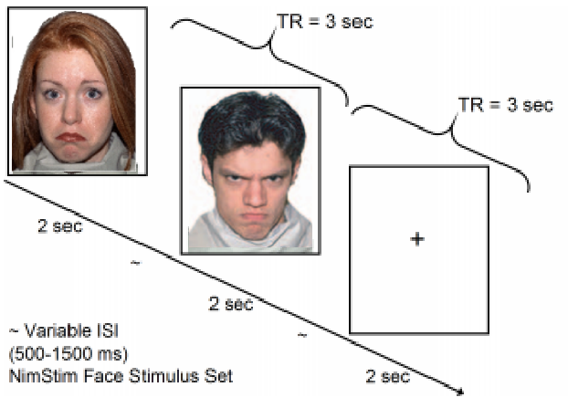
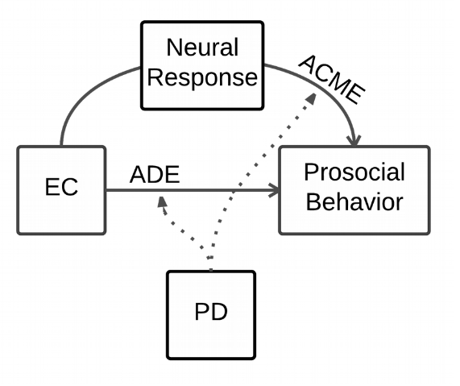
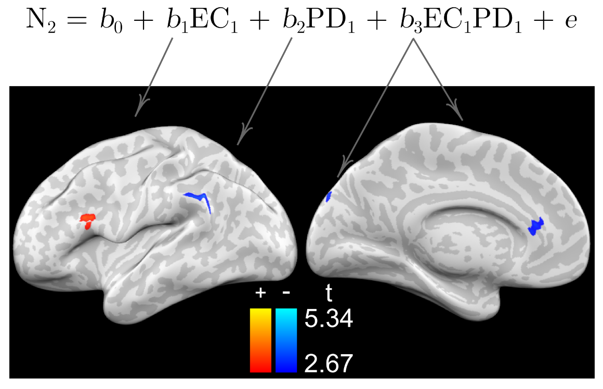
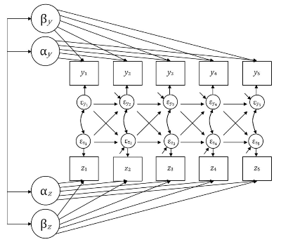
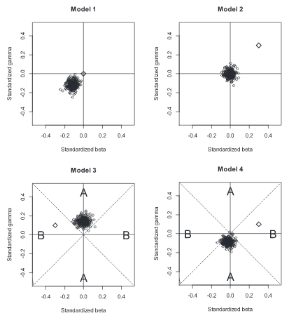
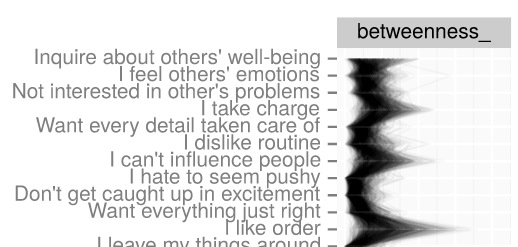

```{r setup, include=FALSE}
knitr::opts_chunk$set(echo = FALSE, warning = FALSE, error = FALSE, message = FALSE)
```

## Introduction

My work in graduate school has been diverse

- Social 
- Neuroscience
- Development
- Personality

## Interests

My interests are both

- Substantive
    - Adolescent, motivated decision-making
    - Development of stable individual differences
- Methodological
    - Cognitive models of behavior
    - Refined models of development
    - Emphasis on uncertainty

## Projects

Four projects (and what I've learned about doing science from some of them):

1. Neural correlates of empathy-motivated prosocial behavior
2. Interactions between personality and values in adult development
3. The Yellow Light Game and adolescent risk-taking
4. Measuring adolescent-developing motivations

# Neural correlates of empathy-motivated prosocial behavior <small>([2016](https://dx.doi.org/10.17605/OSF.IO/RJH48))</small>

Do individual differences in empathic concern predict future prosocial behavior? Is this mediated by "affective resonance" neural processes?

## Empathy and Prosocial Behavior

*Empathic concern:* Sympathy, compassion; aligned emotions _for_ another person's suffering. 

Evidence of association between EC and prosocial behavior throughout development (Barr & Higgins-D’Alessandro, 2007; Brownell et 
al., 2013; Eisenberg, 2003; Eisenberg et al., 1991; Eisenberg et al., 1987; Farrant et
al., 2012; 
Litvack-Miller et al., 1997)

## What reactive neural processes are involved?

Empathic concern is an emotional reaction that will be activated by other people's emotional expressions.

Given that a neural region is functionally active in response to other people's emotions, does that functional activation explain some of the link between EC and prosocial behavior?

What does a particular region's involvement tell us about this link?

## The study

Two waves, only participants with fMRI at wave 1 & 2.

>- $N = 56 (N_{\text{male}} = 26$)
>- fMRI during passive viewing of emotional faces (NimStim).
>- Questionnaires

## fMRI paradigm



## Quesitonnaire Measures

Measures of target constructs:

- Interpersonal Reactivity Index (Davis, 1983)
    - Empathic Concern
    - Personal Distress
- Questions from the 4-H Study of Positive Youth Development survey (Lerner et al., 2005)
    - >During an average week, how many 
hours do you spend helping other people without getting paid (such as helping out at a hospital, 
daycare center, food shelf, youth program, community service agency, or doing other things)
    - Item asking if they are often kind to other children.

## Descriptives at a glance

Table of Mean Scores (with Standard Deviation)

```{r}
library(tidyverse)
knitr::kable(
    tribble(
        ~Wave, ~Age, ~`Empathic Concern`, ~`Personal Distress`, ~`Prosocial Behavior`,
        1, '10.1 (.31)', '59.0 (13.3)', '45.1 (13.1)', '49.1 (16.2)',
        2, '13.1 (.31)', '63.8 (12.9)', '39.7 (14.8)', '48.0 (18.2)'
        
    )
)
```

## Analyses



## Results

Empathic concern at age Wave 1 predicts prosocial behavior at wave 2

$b = 0.44, t(51) = 2.42, p = .02$

Empathic concern at wave 1 predicts neural response to faces at wave 2

```{r, out.width = "400px"}

```

## Results - Mediation

IFG (peak at [-51, 20, 25]) mediates relation between wave 1 EC and wave 2 PSB

$\Delta 1 \text{SD}_{\text{EC}} = \Delta 0.38 \text{SD}_{\text{PSB}}$

Proportion of effect mediated = .51, p = .01.

## Limitations

or, what I've learned since then:

1. AFNI's 3dClustSim was buggy (Eklund et al., 2016)
2. Mediation is fraught (Bullock et al., 2010)
    - [Simulations](https://jflournoy.github.io/2016/09/02/mediation_power/#misspecification): under DGM of three correlated variables with _no_ mediation, mediation models that _don't_ control for prior levels of both Y and M systematically show evidence of mediation. 
    
# Interactions between personality and values in adult development <small>(submitted)</small>

Personality changes throughout adulthood. Do changes in values drive some of this change? How to best model these influences?

## The study

>- Cohort-sequential, 4 waves
>- Nationally representative
>- N = 879, 44% male, age 18&ndash;63, M = 36 (10.5)

## Measures

- Personality
    - Big five, aspects, and super-factors
- Values 
    - Mature values
    - Unmitigated self interest
    - materialism
    - financial aspirations
    - individualism & collectivism

## Model for longitudinal change

Cross-lagged panel model, but _better_:

<big>The Latent Curve Model with Structured Residuals</big> (LCM-SR; Curran et al., 2013)



## Why not cross-lagged panel models?

Models need to account for both between- and within-person variance or risk extreme bias (Hamaker et al., 2015).

```{r, out.width = "350px"}

```

Figure 2. Simulations reveal misspecification bias

## [Results](https://jflournoy.github.io/lnt_pxvx/bivariate_LCMSR_models.html#parameter-estimates)

_A lot_ of intercept-to-intercept correlations at p < .005. 

For example, Agreeableness (and facet) intercepts negatively correlate with financial aspirations, materialism, unmitigated self-interest, and individualism.

Lagged effects:

- Mature Values $+ \rightarrow$ Openness 
- Materialism  $- \rightarrow$ Social-self-regulation
- Vertical Individualism $- \rightarrow$ Compassion, Politeness, Intellect, and Openness. 
- Openness $\leftarrow - \rightarrow$ Vertical Individualism

## Substantive takeaway

- Evidence _against_ essentialist trait perspective
- Culture shapes the person (possibly more at different ages)
- Much between & within person correlation

## Network Models

- Massively bi-variate approach is lacking
- Good recent work on psychological networks [[1](http://psych-networks.com/7-new-papers-network-replicability/), [2](http://sachaepskamp.com/Dissertation)]
    - Tests idea that certain constructs (e.g., mental illness) are not best characterized by unitary latent causes.
- Preliminary work on this data set is promising

## [Networks of personality](https://figshare.com/articles/A_Network_Approach_to_Characterizing_Personality_in_the_Life_and_Time_Longitudinal_Sample/1447279/2)

Bootstrapped, regularized partial-correlation networks and network statistics (using UO high-performance computing cluster)


## Centrality statistcs

E.g., betweenness: how many shortest routes does a node sit on?



## Advantages and pitfalls of the approach

- The strength: 
    - Rich characterization of mediating relations
    - Characterize propagation
    - Modularity without unknown causes
- The pitfalls: 
    - Mediation 
    - Unclear how to characterize uncertainty
    - Each node is a construct (with measurement issues)

## Future directions

Claims about ties between nodes strengthened by

- High-frequency longitudinal data
- Appropriate modeling of variance (e.g. LCM-SR, RI-CLPM)
    - Between-person correlations make bad edges

# Interim summary

Model misspecification can _easily_ lead one to make categorically incorrect decisions

Different models can powerfully encode different hypotheses

# Adolescent risk taking

The big question: Why do negative health outcomes increase in adolescence?

## Uncertain reward

Focus on choosing risky rewards, and peer influences.

Stoplight game.

## Stoplight game

- Neural correlates with convergent measures (e.g., sensation-seeking; CITE)
- Behavior is ambiguous
- Some problems
    - Performance and risk choice (CITE)
    - Different operationalizations of risk (CITE)
    - Non-decisions (CITE)

## The Yellow Light Game

Customizable. This version:

- Performance balanced between risk and safe options
- Possible optimal mix of risk and non-risk
- Decision is required

## Modeling questions

Do participants 


My approach: How do the motivations behind "motivated adolescent behavior" change?


